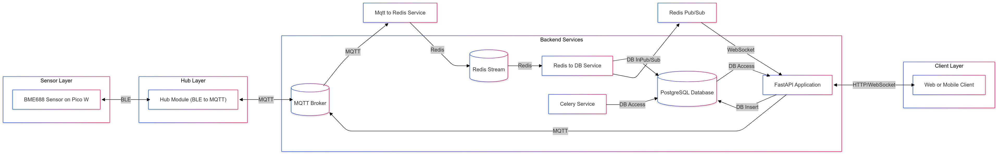
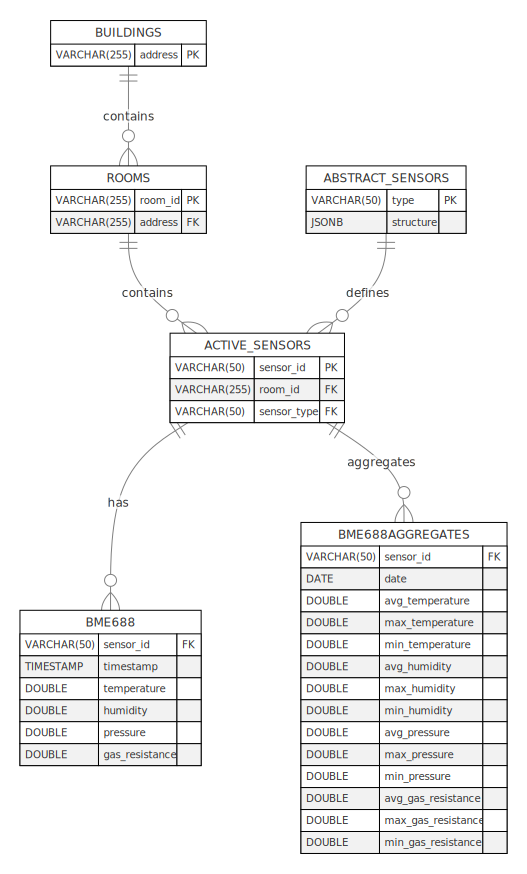

# Smart Home Automation System

# Overview

The **Smart Home Automation System** is an IoT-based application designed to collect environmental data from various sensors and manage various IoT devices. It provides real-time updates, historical data, and allows users to have a better understanding of their enviroment. In later versions, it will allow users to create routines for a range of IoT devices such as actuators, switches, radios, etc.

# Architecture Overview


# Project Structure
```
smart-home/
|   .gitignore
|   LICENSE
|   README.md
|
+---assets
|       Hub_Service_Flowchart.svg
|       PicoWHwiring.png
|       Smart_Home_Flowchart.png
|       Smart_Home_Flowchart.svg
|       postgres_erd.svg
|
+---back_end
|   +---back_end
|   |   |   docker-compose.yml
|   |   |   init.sql
|   |   |   mosquitto.conf
|   |   |
|   |   +---app
|   |   |   |   database.py
|   |   |   |   dockerfile
|   |   |   |   main.py
|   |   |   |   README.md
|   |   |   |   requirements.txt
|   |   |   |   __init__.py
|   |   |   |
|   |   |   +---models
|   |   |   |     hub.py
|   |   |   |     sensor.py
|   |   |   |
|   |   |   +---routes
|   |   |   |     health.py
|   |   |   |     hub.py
|   |   |   |     sensor.py
|   |   |   |     websocket.py
|   |   |   |
|   |   |   |
|   |   |   +---services
|   |   |         db_service.py
|   |   |         mqtt_service.py
|   |   |         websocket_manager.py
|   |   |
|   |   |
|   |   +---celery_service
|   |   |       celery_config.py
|   |   |       Dockerfile
|   |   |       Dockerfile.beat
|   |   |       requirements.txt
|   |   |       tasks.py
|   |   |
|   |   +---mqtt_to_redis
|   |   |       .envexample
|   |   |       dockerfile
|   |   |       mqtt_to_redis.py
|   |   |       README.md
|   |   |       requirements.txt
|   |   |
|   |   |
|   |   +---redis_to_db
|   |         .envexample
|   |         dockerfile
|   |         README.md
|   |         redis_to_db.py
|   |         requirements.txt
|   |
|   \---tests
+---hub
|   |   README.md
|   |
|   +---hub
|   |       .envexample
|   |       ble.log
|   |       ble_client.py
|   |       config.py
|   |       dockerfile
|   |       hub_manager.py
|   |       main.py
|   |       requirements.txt
|   |       __init__.py
|   |
|   \---test
|
\---sensors
    \---BME688PICOWH
            ble.py
            bme680.py
            main.py
            README.md
```

# Database Relationship Diagram


# Features
  - **Environmental Monitoring**: Collects various environmental data using sensors.
  - **Real-Time Data Streaming**: Provides live updates through WebSockets.
  - **Historical Data**: Stores data in PostgreSQL for historical analysis.
  - **Modular Architecture**: The project is composed of independent, decoupled modules for sensors, hubs, and backend services.
  - **Scalable and Extensive**: The system is designed to allow horizontal scaling for most modules and physical devices such as sensors and hubs.

# Services
## Sensor Modules
### BME688 sensor on Pico W
<a href="sensors/BME688PICOWH/README.md">BME688 ReadMe file</a>

Collects environmental data and transmits it over BLE to a central hub specific to that location.

**Data Collected**
- Temperature
- Humidity
- Pressure
- Gas Resistance

**Communication**
- Uses BLE to send data to a connected central hub through notifications.

## Hub Service
<a href="hub/README.md">Hub Service ReadMe file</a>

Designed to act as a bridge between the sensor peripherals and the backend services.
Multiple instances can be deployed to monitor multiple locations at once.
- **BLE Connectivity**: Connects to sensors using Bleak and communicates with them using BLE.
- **Data Handling**: Data received is unpacked and prepared for transmission.
- **MQTT Integration**: Sends and receives data from the backend through an MQTT broker.

## Backend Services

**FastAPI Application**
  - Provides RESTful and WebSocket endpoints for clients to retrieve data and command hubs. # Later on will provide endpoints for controlling different types of IoT devices.
  - <a href="back_end/back_end/app/README.md">App Service ReadMe file</a>

**MQTT to Redis Service**
  - Handles incoming data from hubs and pushes it to a Redis Stream.
  - <a href="back_end/back_end/mqtt_to_redis/README.md">MQTT to Redis service ReadMe file</a>

**Redis to Db Service**
  - Reads data from Redis Streams, processes it, stores it in the appropriate table of the PostgreSQL database, and publishes sensor id specific updates via Redis Pub/Sub.
  - <a href="back_end/back_end/redis_to_db/README.md">Redis to Db Services ReadMe file</a>

**Celery Service**
  - Runs data aggregation tasks periodically.

## Setup and Installation
### Prerequisites
**Hardware**
  - **BME688 mounted on Pico W** (only available sensor at the moment)
  - **Raspberry Pi 4 model B** (or any BLE-capable device that can run 24/7)
  - `Optional` Hetzner Cloud Server

**Software**
  - **Python 3.11** or higher
  - **Docker** and **Docker Compose**
  - **MQTT Broker** (`Eclipse Mosquitto` or `HiveMQ`)
  - **Redis Server**
  - **PostgreSQL Server**

**Installation**
  - **Clone the Repository**
    ```
      git clone https://github.com/jipelski/smart-home.git
      cd smart-home
    ```
**Setting up the Sensor Module**
  - Access the appropriate ReadMe.md file for your specific sensor in the sensors <a href="sensors/">repository</a> for the setup instructions.

**Setting up the Hub Service**
  - Navigate to the <a href="hub/">hub</a> directory and follow the ReadMe file instructions.

**Setting up the Backend Services**
  - Ensure you have an appropriate `.env` file, `init.sql`, and `mosquitto.conf` file in your repository.
  - Run docker compose command:
  - `docker compose up`

# Usage
## Accessing the Web Interface
Open your browser and navigate to `https://localhost:8000/docs` to access the FastAPI application.

## API endpoints
An extensive list of the API endpoints can be found <a href="back_end/back_end/app/README.md#api-endpoints">here</a>.

# License
This project is licensed under the MIT License - see the <a href="LICENSE">License</a> for more details.

# Acknowledgements
  - **Adafruit**: for providing sensor libraries.
  - **Bleak**: For the BLE client library used.
  - **FastAPI**: For the web framework.
