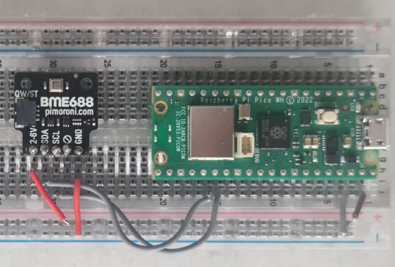

# BME688 sensor integrated to Raspberry Pi Pico W

An approach to integrating a BME688 sensor with the Raspberry Pi Pico W (RP2040) utilizing GPIO pin connections, MicroPython, and Bluetooth Low Energy to broadcast environmental data.

## Components

**Hardware**
- Raspberry Pi Pico W
- BME688 sensor

**Software**
- Micropython firmware with BLE support
- `ble.py` : Handles the BLE peripheral functionality.
- `bme680.py` : MicroPython driver by Adafruit for the BME680 sensor - it can also be used for BME688.
- `main.py` : Main script to read sensor data and sent it over BLE.

## How it works

**Initialisation**
- Pico W initialises I2C communication with the BME688 sensor.
- Pico W sets up BLE peripheral with custom name, service, and characteristics.
- BLE module starts advertising the service.

**Data Reading**
- Data is read from the BME688 sensor using a custom structure.

**Data Transmission**
- Environmental data is being packed with the current timestamp.
- If device is connected to BLE central device:
  - Sends data to connected BLE central device via notifications.
    
**Service Advertising**
- BLE module advertises it's service using gap.
- On connect event to BLE central device, it stops gap advertising and starts gatts notifications.
- On disconnect envent from BLE central device, it stops gatts notifications and restarts gap advertising.

## Setup and Installation

**Wiring**
- Connect the BME688 sensor to the Pico W using IC2 by mapping SCL to GP21, SDA to GP20, GND(on BME688) to GND(on Pico W), and 2-6V to VBUS.

**Flash MicroPython Firmware**
- Download and flash the latest MicroPython firmware onto the Pico W using the following link: <a href="https://www.raspberrypi.com/documentation/microcontrollers/micropython.html#what-is-micropython">Raspberry Pi Documentation</a>

**Upload Scripts**
- Use Thonny to upload `ble.py`, `bme688.py` and `main.py` to Pico W.

**Running the Scripts**
- If connected to a computer:
   - Run the `main.py` script.
- The `main.py` script will be run automatically on boot when connected to a power source.

## Notes

**Time Sinchronization**
- Currently, the RTC is manually set in the script. This leads to inaccurate timestamps in the event of the picow going offline.
   
**BLE Central Device**
- In order to receive data from this sensor, you need to ensure the existance of a central hub that can connect to the Pico W and handle the incoming data. I am using a Raspberry Pi 4 running a hub service that can be found <a href="../../hub/hub"> here </a>
